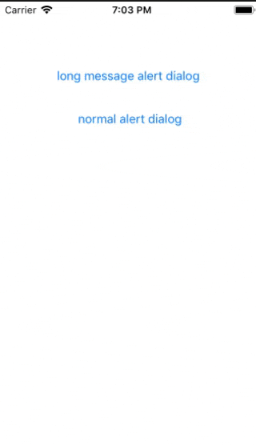
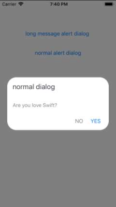

# ZDialog

[](https://travis-ci.org/zabih-raadco/ZDialog)
[](https://cocoapods.org/pods/ZDialog)
[](https://cocoapods.org/pods/ZDialog)
[](https://cocoapods.org/pods/ZDialog)

##### ZDialog lib for easy to show a dialog like as alert dialog
ZAlertDialog is simple to show an alert dialog with `support multi line` for the title and message is `scrollable` if you set the long message.



Here are some usage examples:



```swift
import UIKit
import ZDialog
class ViewController: UIViewController {

    lazy var alertDialog = ZAlertDialog()
    
    override func viewDidLoad() {
    super.viewDidLoad()
    }
    
    @IBAction func showNormalDialog(_ sender: UIButton) {
        alertDialog
        .setTitle("normal dialog")
        .setMessage("Are you love Swift?")
        .setOkButton("YES")
        .setCancelButton("NO")
        .setOkButton(onTapListener: {
            print("ok button tapped")
        })
        .showDialog(self)
    }

}
```


## Available methods

```swift
//Set the title of the dialog
setTitle(_ title)
//Set the title of the dialog
setMessage(_ message)
//hidden or show buttons(ok, cancel)
setHiddenButtons()
//set title and tap listener for Ok button
setOkButton(_ title, onTapListener)
//set title and tap listener for Cancel button
setCancelButton(_ title, onTapListener)

//support rtl or ltr
setRTL(_ isRTL)
//Set position of the dialog (style => .center, .bottom)
setPositionStyle(_ style)
//When dismisses the dialog this method called
setOnDismissListener()
//allow or not allow to user for dismiss the dialog when tap around of dialog
setCancelable(_ isCancelable)
```


## Installation

ZDialog is available through [CocoaPods](https://cocoapods.org). To install
it, simply add the following line to your Podfile:

```ruby
pod 'ZDialog'
```

## Author

zabih, zabih1420@gmail.com

## License

ZDialog is available under the MIT license. See the LICENSE file for more info.
